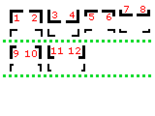

# Introduction

The input BMP image [1] (24-bit RGB) contains markers shown in fig. 1. The image may
contain other elements. Your task is to detect all markers of given type.

Note: for BPM image see `input.bmp`

Characteristics of the markers
The markers are black and consist of two arms (fig. 2). For a given marker type, the ratio of
width W to height H is constant (see table 1). Markers of a given type can be of various sizes
if the proportions of the dimensions of the arms are kept. The marker position is determined
by the point where the arms intersect (marked by P in Fig. 2).

This assignment will aim to detect marker 12

Notes:

-   My operating system did not work wel with relative paths, so I have decided to work with absolute paths, change the path according to filesystem
-   I have added documentation images that I used during the making of this project
-   I have added other images to test the checks of wrong filetype, wrong filesize and other than the given image to test if it works consistently
